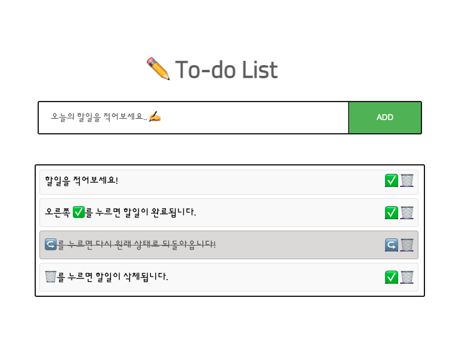
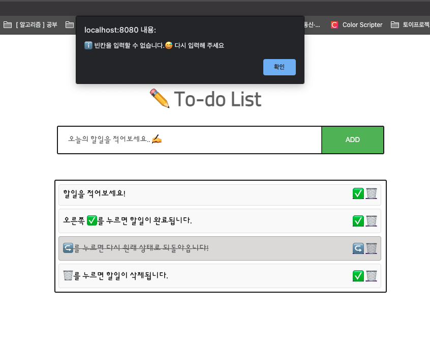
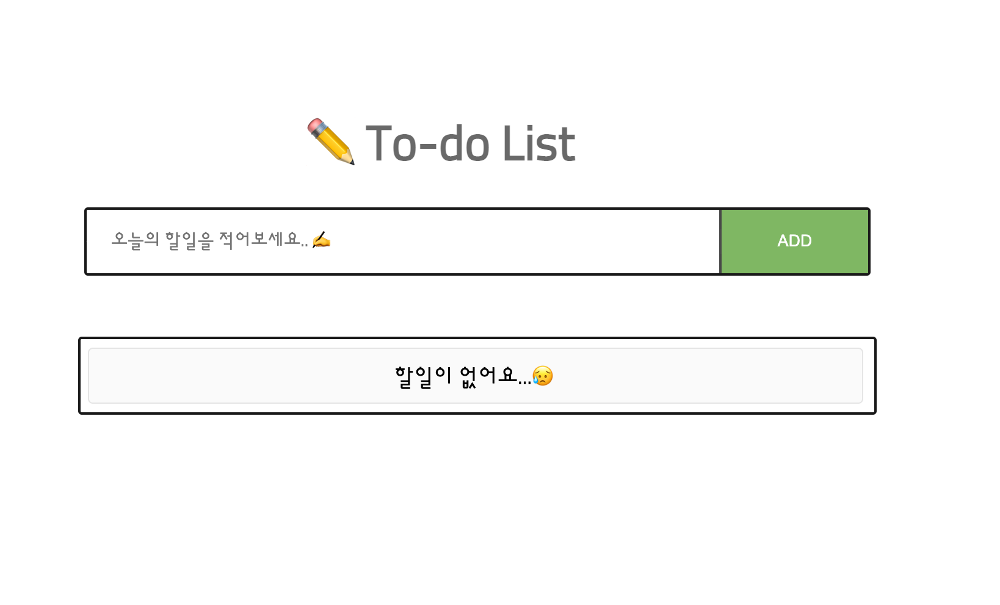

# Spring Web MVC 를 이용한 ✏️ To-do List 구현
`Spring Boot` `Thymeleaf` `JPA` `H2 database`

### DB 기본 설정
시작할 때, 기본으로 테이블은 아래와 같이 생성이 됩니다.
```
DROP TABLE IF EXISTS TODO_ITEM;
create table todo_item
(
    id     bigint generated by default as identity,
    date   date,
    status varchar(255),
    title  varchar(255),
    primary key (id)
)
```

테이블에 To-do List의 설명을 포함한 4가지의 데이터가 미리 들어가 있습니다.
```
insert into todo_item (id, date, status, title)
values (null, '2021-01-28', 'NEVER', '할일을 적어보세요!');
insert into todo_item (id, date, status, title)
values (null, '2021-01-28', 'NEVER', '오른쪽 ✅️ 를 누르면 할일이 완료됩니다.');
insert into todo_item (id, date, status, title)
values (null, '2021-01-28', 'DONE', '↪️ ️를 누르면 다시 원래 상태로 되돌아옵니다!');
insert into todo_item (id, date, status, title)
values (null, '2021-01-28', 'NEVER', '🗑 를 누르면 할일이 삭제됩니다.');
```


 실행 화면
---
* 메인 화면 (홈 화면)
* 경고 화면
* 할일이 없는 경우

#### 메인 화면 (홈 화면)


* 설명
    - ✅ 버튼을 클릭하면, 배경이 흐릿 해지고 글씨에 취소선이 생기면서 할일이 완료 처리가 됩니다.
    - ↪️ 버튼을 클릭하면, 완료 된 할일이 다시 원래 상태(미 완료)로 돌아갑니다.
    - 🗑 버튼을 클릭하면, 할일이 삭제가 됩니다.
    - "오늘의 할일을 적어보세요✍️" 에 할일을 적고 ADD 버튼을 눌러주면 할일이 추가 됩니다.
    - 빈칸을 입력하면 아래와 같이 alert를 발생시키도록 했습니다.
---

#### alert 발생 화면


---
#### 할일이 없는 경우


