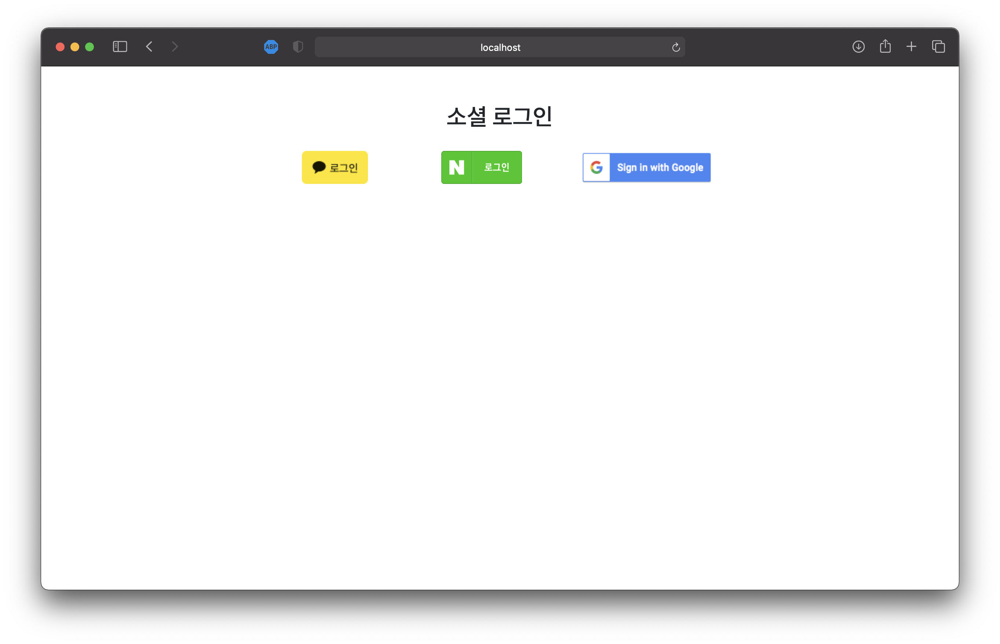
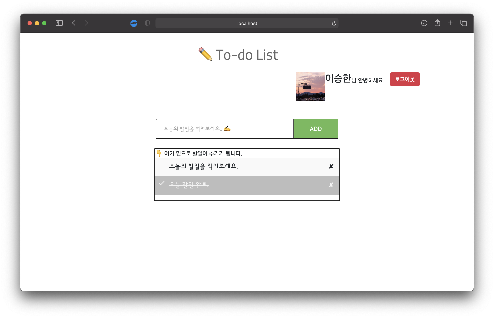
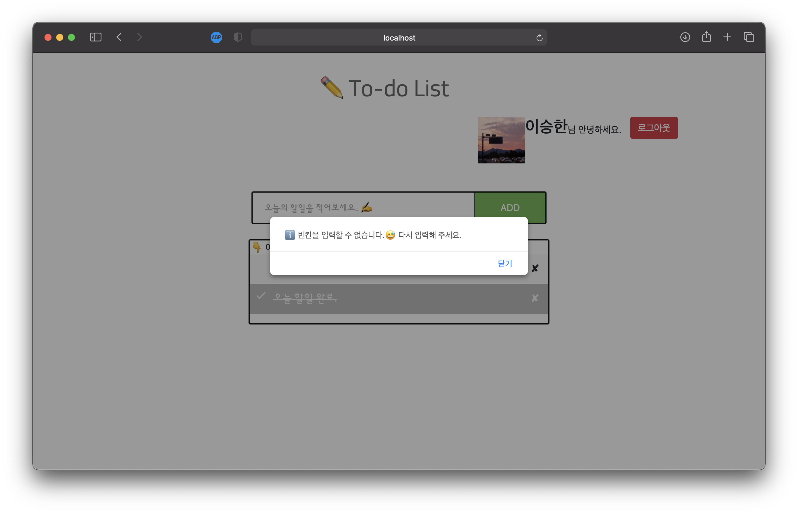
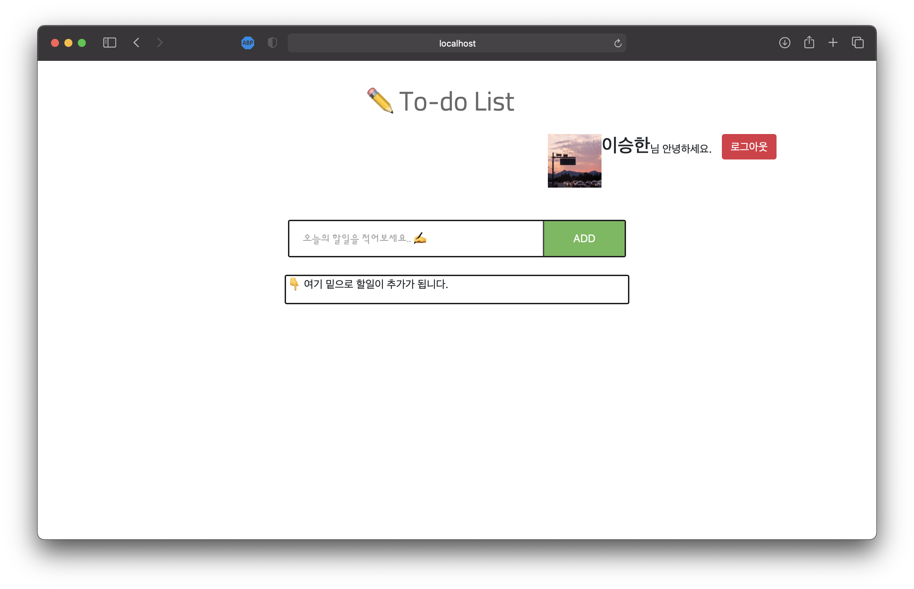

# 💐SpringMVC를 이용한 📝To-Do List 입니다.
`Spring Boot` `Mustache` `Thymeleaf` `Spring Data JPA` `H2 database`

### 실행 화면
* 소셜 로그인 화면
* 메인 화면 (로그인 완료)
* 경고 화면 (빈 칸 입력)
* 할일이 없는 경우

---

#### 소셜 로그인 화면

- "http://localhost:8080/" 으로 접속을 하면 로그인 요청 페이지가 표시됩니다.

---

#### 메인 화면 (로그인 완료)

로그인을 완료하면 해당 유저의 할일들이 표시가 됩니다.

#### 기능 설명
  - 할일을 클릭하면, 배경이 흐릿 해지고 글씨에 취소선이 생기면서 할일이 완료 처리가 됩니다.
  - 완료된 할일을 다시 클릭하면, 완료 된 할일이 다시 원래 상태(미 완료)로 돌아갑니다.
  - ✘ 버튼을 클릭하면, 할일이 삭제가 됩니다.
  - "오늘의 할일을 적어보세요✍️" 에 할일을 적고 ADD 버튼을 클릭하면 할일이 추가 됩니다.
  - 빈칸을 입력하면 아래와 같이 alert를 발생시키도록 했습니다.

---

#### alert 발생 화면

---

#### 할일이 없는 경우

